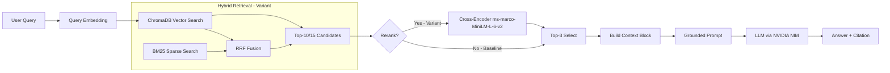

# Architecture — RAG Pipeline (Day 08 Lab)

> Template: Điền vào các mục này khi hoàn thành từng sprint.
> Deliverable của Documentation Owner.

## 1. Tổng quan kiến trúc

```
[Raw Docs]
    ↓
[index.py: Preprocess → Chunk → Embed → Store]
    ↓
[ChromaDB Vector Store]
    ↓
[rag_answer.py: Query → Retrieve → Rerank → Generate]
    ↓
[Grounded Answer + Citation]
```

**Mô tả ngắn gọn:**
Hệ thống RAG dữ liệu nội bộ (Policy, SLA, HR). Kiến trúc sử dụng **ChromaDB** kết hợp hybrid retrieval (BM25 + Dense) và rerank (Cross-Encoder), tận dụng model embedding **BAAI/bge-m3** (local / ngrok) và LLM qua **NVIDIA NIM** (Llama-3.1-405b/Gemma-4-31b) để trích xuất trả lời dựa trên tài liệu.

---

## 2. Indexing Pipeline (Sprint 1)

### Tài liệu được index
| File | Nguồn | Department | Số chunk |
|------|-------|-----------|---------| 
| `policy_refund_v4.txt` | policy/refund-v4.pdf | CS | (auto — phụ thuộc khi chạy index.py) |
| `sla_p1_2026.txt` | support/sla-p1-2026.pdf | IT | (auto — phụ thuộc khi chạy index.py) |
| `access_control_sop.txt` | it/access-control-sop.md | IT Security | (auto — phụ thuộc khi chạy index.py) |
| `it_helpdesk_faq.txt` | support/helpdesk-faq.md | IT | (auto — phụ thuộc khi chạy index.py) |
| `hr_leave_policy.txt` | hr/leave-policy-2026.pdf | HR | (auto — phụ thuộc khi chạy index.py) |

### Quyết định chunking
| Tham số | Giá trị | Lý do |
|---------|---------|-------|
| Chunk size | 400 tokens | Đủ lớn để giữ nguyên một điều khoản/quy định hoàn chỉnh, không quá dài gây lost-in-the-middle |
| Overlap | 80 tokens | Đảm bảo không cắt đứt câu/điều khoản ở ranh giới chunk (~20% của chunk size) |
| Chunking strategy | Section-based (split theo `===...===`) → size-based với overlap | Ưu tiên giữ cấu trúc section tự nhiên của tài liệu; nếu section quá dài mới split theo size với boundary tại `\n\n` hoặc `. ` |
| Metadata fields | source, section, effective_date, department, access | Phục vụ filter, freshness, citation |

### Embedding model
- **Model**: sentence-transformers/BAAI/bge-m3 (Hỗ trợ tiếng Việt/Anh)
- **Vector store**: ChromaDB (PersistentClient) - Local mode
- **Similarity metric**: Cosine

---

## 3. Retrieval Pipeline (Sprint 2 + 3)

### Baseline (Sprint 2)
| Tham số | Giá trị |
|---------|---------|
| Strategy | Dense (embedding similarity) |
| Top-k search | 10 |
| Top-k select | 3 |
| Rerank | Không |

### Variant (Sprint 3)
| Tham số | Giá trị | Thay đổi so với baseline |
|---------|---------|------------------------|
| Strategy | hybrid | Thêm Sparse/BM25 kết hợp với Dense bằng RRF |
| Top-k search | 15 | Tăng số lượng search rộng từ 10 lên 15 |
| Top-k select | 3 | Không đổi |
| Rerank | Có cài (cross-encoder/ms-marco-MiniLM-L-6-v2) nhưng **use_rerank=False** trong lần chạy eval (bug) | Mục tiêu bật reranking, thực tế chưa được bật trong lần eval này |
| Query transform | Không thực hiện (hết thời gian) | Dự kiến: expansion / HyDE / decomposition |

**Lý do chọn variant này:**
Lý do chọn: nhóm chọn cấu hình Hybrid kết hợp Reranker vì tập dữ liệu (corpus) thực tế mang độ phức tạp hỗn hợp: vừa chứa các câu văn diễn đạt bằng ngôn ngữ tự nhiên (trong các tài liệu chính sách policy), lại vừa chứa các tên chuyên ngành và mã lỗi đòi hỏi sự trùng khớp chính xác tuyệt đối (ví dụ như SLA ticket P1, mã lỗi ERR-403). Sự kết hợp này mang ý nghĩa bổ trợ, đảm bảo keyword search giúp không bỏ sót các từ khóa kỹ thuật, trong khi dense search bám sát ngữ nghĩa, và việc qua thêm một màng lọc chấm điểm liên quan (cross-encoder) sẽ đẩy kết quả tốt nhất lên đầu cho LLM.

**Kết quả thực tế (A/B Comparison — 2026-04-13, nguồn: `results/terminal.log` dòng 133–151):**
| Metric | Baseline | Variant | Delta |
|--------|----------|---------|-------|
| Faithfulness | 4.80/5 | 4.90/5 | +0.10 |
| Answer Relevance | 3.80/5 | 3.60/5 | -0.20 |
| Context Recall | 5.00/5 | 5.00/5 | 0.00 |
| Completeness | 3.50/5 | 3.30/5 | -0.20 |

> **Lưu ý:** Variant chạy với `use_rerank=False` trong lần eval này (bug được ghi nhận tại `terminal.log` dòng 77). Kết quả trên đại diện cho Hybrid (BM25+Dense) mà **không có rerank**.
> **Nhận xét:** Baseline Dense thắng variant: Hybrid gây regression ở q07 (Completeness 3→1) và q06 (Faithfulness 5→4) do chọn thêm nhiều chunk nhiễu từ nhiều tài liệu. **Baseline Dense là config tốt nhất** cho corpus này.

---

## 4. Generation (Sprint 2)

### Grounded Prompt Template
```
Answer only from the retrieved context below.
If the context is insufficient, say you do not know.
Cite the source field when possible.
Keep your answer short, clear, and factual.

Question: {query}

Context:
[1] {source} | {section} | score={score}
{chunk_text}

[2] ...

Answer:
```

### LLM Configuration
| Tham số | Giá trị |
|---------|---------|
| Model | meta/llama-3.1-405b-instruct hoặc google/gemma-4-31b-it (NVIDIA NIM) |
| Temperature | 0 (để output ổn định cho eval) |
| Max tokens | 512 |

---

## 5. Failure Mode Checklist

> Dùng khi debug — kiểm tra lần lượt: index → retrieval → generation

| Failure Mode | Triệu chứng | Cách kiểm tra |
|-------------|-------------|---------------|
| Index lỗi | Retrieve về docs cũ / sai version | `inspect_metadata_coverage()` trong index.py |
| Chunking tệ | Chunk cắt giữa điều khoản | `list_chunks()` và đọc text preview |
| Retrieval lỗi | Không tìm được expected source | `score_context_recall()` trong eval.py |
| Generation lỗi | Answer không grounded / bịa | `score_faithfulness()` trong eval.py |
| Token overload | Context quá dài → lost in the middle | Kiểm tra độ dài context_block |
| **Corpus gap** | Recall=None, Relevance=1 dù Faithfulness=5 | Kiểm tra xem tài liệu có tồn tại trong corpus không |

**Failure Mode thực tế đã quan sát (2026-04-13):**
- **q09 (ERR-403-AUTH)** và **q10 (VIP Refund)**: Corpus gap — tài liệu không chứa thông tin. RAG trả lời "không biết" đúng nhưng không hữu ích.
- **q07 (Approval Matrix)**: Baseline — Dense alias miss (Faithfulness=3). Variant — Hybrid noise gây regression (Completeness=1).

---

## 6. Diagram


