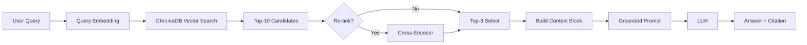

# Architecture — RAG Pipeline (Day 08 Lab)

> Template: Điền vào các mục này khi hoàn thành từng sprint.
> Deliverable của Documentation Owner.

## 1. Tổng quan kiến trúc

```
[Raw Docs]
    ↓
[index.py: Preprocess → Chunk → Embed → Store]
    ↓
[ChromaDB Vector Store]
    ↓
[rag_answer.py: Query → Retrieve → Rerank → Generate]
    ↓
[Grounded Answer + Citation]
```

**Mô tả ngắn gọn:**
Hệ thống RAG dữ liệu nội bộ (Policy, SLA, HR). Kiến trúc sử dụng **ChromaDB** kết hợp hybrid retrieval (BM25 + Dense) và rerank (Cross-Encoder), tận dụng model embedding **BAAI/bge-m3** (local / ngrok) và LLM qua **NVIDIA NIM** (Llama-3.1-405b/Gemma-4-31b) để trích xuất trả lời dựa trên tài liệu.

---

## 2. Indexing Pipeline (Sprint 1)

### Tài liệu được index
| File | Nguồn | Department | Số chunk |
|------|-------|-----------|---------|
| `policy_refund_v4.txt` | policy/refund-v4.pdf | CS | TODO |
| `sla_p1_2026.txt` | support/sla-p1-2026.pdf | IT | TODO |
| `access_control_sop.txt` | it/access-control-sop.md | IT Security | TODO |
| `it_helpdesk_faq.txt` | support/helpdesk-faq.md | IT | TODO |
| `hr_leave_policy.txt` | hr/leave-policy-2026.pdf | HR | TODO |

### Quyết định chunking
| Tham số | Giá trị | Lý do |
|---------|---------|-------|
| Chunk size | TODO tokens | TODO |
| Overlap | TODO tokens | TODO |
| Chunking strategy | Heading-based / paragraph-based | TODO |
| Metadata fields | source, section, effective_date, department, access | Phục vụ filter, freshness, citation |

### Embedding model
- **Model**: sentence-transformers/BAAI/bge-m3 (Hỗ trợ tiếng Việt/Anh)
- **Vector store**: ChromaDB (PersistentClient) - Local mode
- **Similarity metric**: Cosine

---

## 3. Retrieval Pipeline (Sprint 2 + 3)

### Baseline (Sprint 2)
| Tham số | Giá trị |
|---------|---------|
| Strategy | Dense (embedding similarity) |
| Top-k search | 10 |
| Top-k select | 3 |
| Rerank | Không |

### Variant (Sprint 3)
| Tham số | Giá trị | Thay đổi so với baseline |
|---------|---------|------------------------|
| Strategy | hybrid | Thêm Sparse/BM25 kết hợp với Dense bằng RRF |
| Top-k search | 15 | Tăng số lượng search rộng từ 10 lên 15 |
| Top-k select | 3 | Không đổi |
| Rerank | YES (cross-encoder/ms-marco-MiniLM-L-6-v2) | Bật reranking |
| Query transform | TODO (expansion / HyDE / decomposition) | TODO |

**Lý do chọn variant này:**
Lý do chọn: nhóm chọn cấu hình Hybrid kết hợp Reranker vì tập dữ liệu (corpus) thực tế mang độ phức tạp hỗn hợp: vừa chứa các câu văn diễn đạt bằng ngôn ngữ tự nhiên (trong các tài liệu chính sách policy), lại vừa chứa các tên chuyên ngành và mã lỗi đòi hỏi sự trùng khớp chính xác tuyệt đối (ví dụ như SLA ticket P1, mã lỗi ERR-403). Sự kết hợp này mang ý nghĩa bổ trợ, đảm bảo keyword search giúp không bỏ sót các từ khóa kỹ thuật, trong khi dense search bám sát ngữ nghĩa, và việc qua thêm một màng lọc chấm điểm liên quan (cross-encoder) sẽ đẩy kết quả tốt nhất lên đầu cho LLM.

---

## 4. Generation (Sprint 2)

### Grounded Prompt Template
```
Answer only from the retrieved context below.
If the context is insufficient, say you do not know.
Cite the source field when possible.
Keep your answer short, clear, and factual.

Question: {query}

Context:
[1] {source} | {section} | score={score}
{chunk_text}

[2] ...

Answer:
```

### LLM Configuration
| Tham số | Giá trị |
|---------|---------|
| Model | meta/llama-3.1-405b-instruct hoặc google/gemma-4-31b-it (NVIDIA NIM) |
| Temperature | 0 (để output ổn định cho eval) |
| Max tokens | 512 |

---

## 5. Failure Mode Checklist

> Dùng khi debug — kiểm tra lần lượt: index → retrieval → generation

| Failure Mode | Triệu chứng | Cách kiểm tra |
|-------------|-------------|---------------|
| Index lỗi | Retrieve về docs cũ / sai version | `inspect_metadata_coverage()` trong index.py |
| Chunking tệ | Chunk cắt giữa điều khoản | `list_chunks()` và đọc text preview |
| Retrieval lỗi | Không tìm được expected source | `score_context_recall()` trong eval.py |
| Generation lỗi | Answer không grounded / bịa | `score_faithfulness()` trong eval.py |
| Token overload | Context quá dài → lost in the middle | Kiểm tra độ dài context_block |

---

## 6. Diagram (tùy chọn)

> TODO: Vẽ sơ đồ pipeline nếu có thời gian. Có thể dùng Mermaid hoặc drawio.


